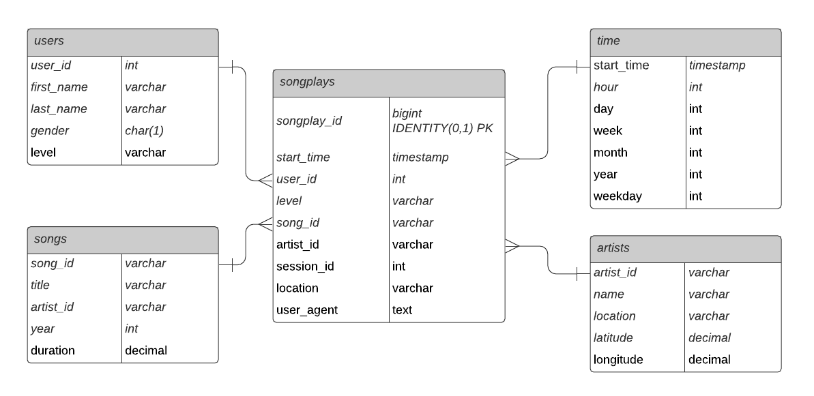

# 1) Introduction

The startup company Sparkify launched a new music streaming app and wants to get insights about the music preferences of their users, in particular Sparkify wants to understand what songs users are listening to.

The goal of this project is to build a consistent Amazon Redshift Data Warehouse which will serve as a single source of truth for data analysis. A Python ETL pipeline is designed to update the database with the collected data which currently resides in an AWS S3 bucket of JSON logs on user activity, as well as a directory with JSON metadata on the songs.

# 2) Repository
### Structure:

**Source Data:**  
*AWS S3 Bucket:*
https://s3.console.aws.amazon.com/s3/buckets/udacity-dend
- log_data/
- song_data/
- log_json_path.json

**Files:**
- create_tables.py
- dwh.cfg
- etl.py
- README.md
- sql_queries.py
- test.py

### Explanation:
#### Source Data:
- log_data/ and song_data/ contains JSON files collected from the app. 
- log_json_path.json is a JSONPaths file to parse the JSON source data for log_data/. Link to AWS explanation: 
https://docs.aws.amazon.com/redshift/latest/dg/copy-usage_notes-copy-from-json.html

#### Files:
- **create_tables.py:** *python script to create the AWS Redshift database tables.*
- **dwh.cfg** *configuration file for AWS Redshift database / roles and S3 connection.*
- **etl.py:** *python ETL script which reads the JSON sourcefiles and inserts it into the AWS Redshift database tables.*
- **README.md** *describes the project.*
- **sql_queries.py:** *SQL file which includes create/drop table and copy/insert statements used in the database creation and ETL process.*
- **test.py:** *python script to execute an aumtomated ETL test, main focus is unique primary keys in the dimension tables and the record count in the fact table.*

# 3) Database and Schema
The purpose of the "sparkifydb" database is data analysis, hence a dimensional model (STAR Schema) is used to allow for optimized data reading and data aggregation.

### Benefits of Amazon Redshift
- Cloud Managed
- Massively Parallel Processing
- Column Oriented Storage
- Easy to scale

### Benefits of the STAR Schema
- Simplifies Queries (less joins needed)
- Faster Aggregation (e. g. sums, counts)
- Easy to understand

### Tables
The schema includes the following tables and fields:  
#### Staging Tables
***stg_events***
- artist
- auth
- firstName
- gender
- itemInSession
- lastName
- length
- level
- location
- method
- page
- registration
- sessionId
- song
- status
- ts
- userAgent
- userId

***stg_songs***
- artist_id
- artist_latitude
- artist_location
- artist_longitude
- artist_name
- duration
- num_songs
- song_id
- title
- year

#### Fact Table
***songplays***
- songplay_id
- start_time
- user_id
- level
- song_id
- artist_id
- session_id
- location
- user_agent

#### Dimension Tables
***users***
- user_id
- first_name
- last_name
- gender
- level

***songs***
- song_id
- title
- artist_id
- year
- duration

***artists***
- artist_id
- name
- location
- latitude
- longitude

***time***
- start_time
- hour
- day
- week
- month
- year
- weekday

### Datamodel

# 4) ETL Pipeline
### Installation
The following items must be installed prior to execution:
- Python
- Python Libraries:
    - psycopg2

### Execution
This section explains the execution of the ETL pipeline.
The python scripts can be run from a terminal and must be executed in the following order.

1. create_tables.py
- creates AWS Redshift database "sparkifydb"
- drops/creates tables as mentioned in section "Database Schema" using sql_queries.py
- after successful creation the script prints "Process suceeded"; in case of an error the process prints "Process failed"
- make sure to run this script always prior to execution of etl.py

2. etl.py
- script reads data from sourcfiles and copies data from S3 into the staging tables
- script reads data from staging tables and inserts data into the target tables (dimension and fact tables)
- script uses file sql_queries.py containing the table copy and insert statements
- after successful creation the script prints "Process suceeded"; in case of an error the process prints "Process failed"

3. test.py (optional)
- script runs an automated ETL test comparing record counts between staging and target tables
- script prints the test results
- after successful creation the script prints "Process suceeded"; in case of an error the process prints "Process failed"

### 5) Ressources
This section lists additional ressources used:
https://docs.aws.amazon.com/redshift/latest/dg/r_COPY.html
https://docs.aws.amazon.com/redshift/latest/dg/copy-parameters-data-conversion.html#copy-timeformat